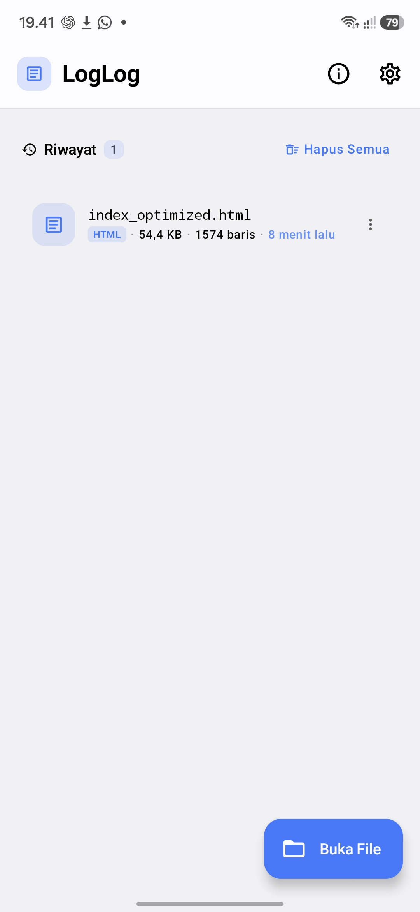
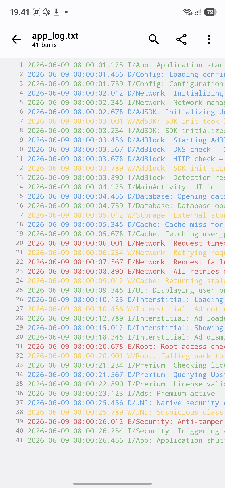
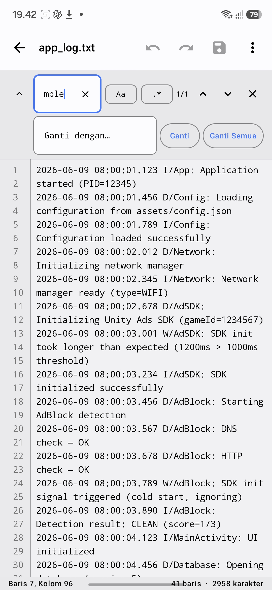
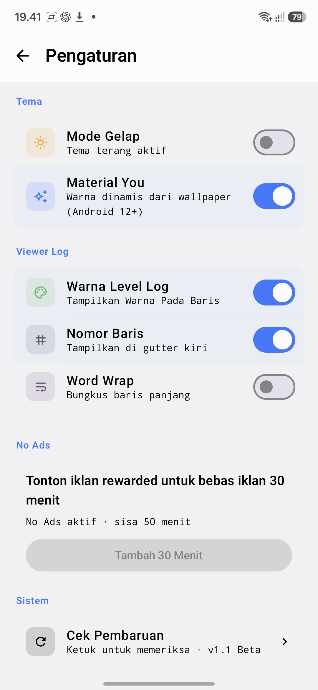

# 📜 LogLog Viewer

Android app for viewing, reading, and editing log files with a clean Material Design UI.

  
  
  
  
  

**Maintainer: Aether Dev**

---

## Overview

LogLog Viewer is an Android application designed to make log viewing easier, faster, and more comfortable. It combines a viewer, editor, recent files, and ad-supported features into one app.

## Features

### Log Viewer
- Open and read log files.
- Fast access for commonly used files.
- Clean and readable viewing layout.

### Editor
- Edit log content directly inside the app.
- Save changes after editing.
- Simple and lightweight text handling.

### File Management
- Recent files list.
- Open with external apps.
- File type detection.

### Appearance
- Material Design 3.
- Light and dark mode support.
- Dynamic color support on compatible devices.

### Ads & Reward System
- Interstitial ads.
- Rewarded ads.
- No Ads for 30 minutes after watching a rewarded ad.
- Daily limit: 2 reward activations.

### Updates
- Update checker.
- Version notification support.

---

## Screenshots

<table align="center">
  <tr>
    <td></td>
    <td></td>
  </tr>
  <tr>
    <td></td>
    <td></td>
  </tr>
</table>

---

## 📱 Android Support

| Requirement | Version |
|------------|---------|
| Minimum SDK | API 30 (Android 11) |
| Target SDK | API 36 |
| Architecture | ARM64 / ARMv7 |
| UI Toolkit | Jetpack Compose |

---

## 🛠 Tech Stack

- Kotlin
- Jetpack Compose
- Material 3
- AndroidX
- Coroutines
- SharedPreferences / DataStore
- Google Mobile Ads SDK

---

## 🤝 Contributing

Contributions, bug reports, and feature requests are welcome.

### Reporting Bugs

Please include:

- Device model
- Android version
- App version
- Steps to reproduce
- Screenshots (if possible)

---

## 📋 Roadmap

- [ ] Search improvements
- [ ] Export logs
- [ ] Multi-tab viewer
- [ ] Cloud synchronization
- [ ] Advanced filtering
- [ ] Log highlighting

---

## 👨‍💻 Maintainer

**Aether Dev**

---

## ⭐ Support

If you like this project:

- Star the repository
- Report bugs
- Suggest new features
- Share feedback

---